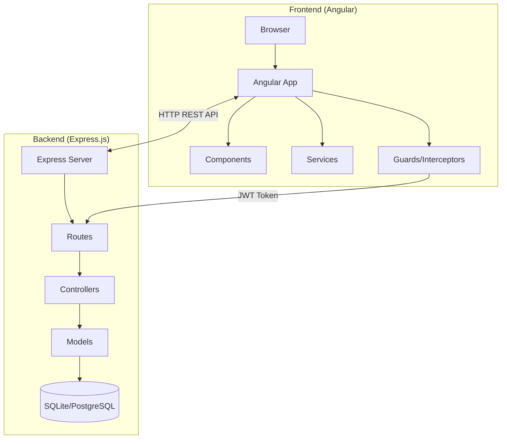
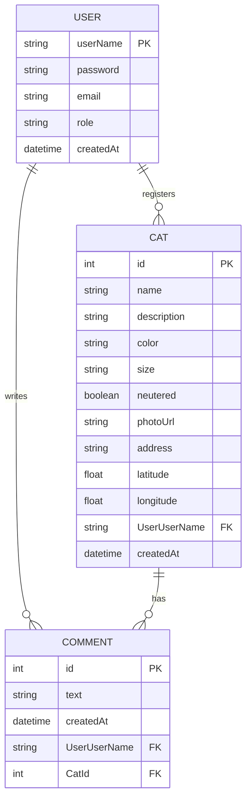

# 🐱 WEBTECH'S STREETCATS - Piano di Sviluppo

## Descrizione del Progetto

L'applicazione **StreetCats** è un sistema per la segnalazione e gestione dei gatti di strada. Gli utenti possono registrarsi, segnalare avvistamenti di gatti randagi, visualizzare le segnalazioni sulla mappa, e contribuire alla comunità di volontari.

---

## 🏗️ Architettura del Sistema



---

## 🛠️ Stack Tecnologico

### **Backend (Server)**

| Componente | Tecnologia | Descrizione |
|------------|------------|-------------|
| **Runtime** | Node.js | Ambiente di esecuzione JavaScript |
| **Framework** | Express.js 4.x | Framework web minimale e flessibile |
| **ORM** | Sequelize | Object-Relational Mapping per database |
| **Database** | SQLite (dev) / PostgreSQL (prod) | Database relazionale |
| **Autenticazione** | JWT (jsonwebtoken) | Token-based authentication |
| **Logging** | Morgan | HTTP request logger middleware |
| **API Docs** | Swagger (swagger-jsdoc, swagger-ui-express) | Documentazione API OpenAPI |
| **CORS** | cors | Cross-Origin Resource Sharing |
| **Environment** | dotenv | Gestione variabili ambiente |

### **Frontend (Client)**

| Componente | Tecnologia | Descrizione |
|------------|------------|-------------|
| **Framework** | Angular 19.x | Framework SPA component-based |
| **Routing** | @angular/router | Client-side routing |
| **HTTP** | @angular/common/http | HTTP client con interceptors |
| **Styling** | SCSS + TailwindCSS | Styling moderno e responsive |
| **JWT Decode** | jwt-decode | Decodifica token JWT |
| **Notifiche** | ngx-toastr | Toast notifications |
| **Mappe** | Leaflet / OpenStreetMap | Visualizzazione mappe (opzionale) |

---

## 📊 Modello dei Dati



---

## 📁 Struttura delle Cartelle

### Backend (Express)

```
streetcats-backend/
├── index.js                    # Entry point
├── .env                        # Variabili ambiente
├── package.json
├── models/
│   ├── Database.js             # Configurazione Sequelize
│   ├── User.js                 # Modello utente
│   ├── Cat.js                  # Modello gatto
│   └── Comment.js              # Modello commento
├── controllers/
│   ├── AuthController.js       # Logica autenticazione
│   ├── CatController.js        # CRUD gatti
│   └── CommentController.js    # CRUD commenti
├── routes/
│   ├── authRouter.js           # Routes autenticazione
│   ├── catRouter.js            # Routes gatti
│   └── commentRouter.js        # Routes commenti
├── middleware/
│   ├── authorization.js        # Verifica JWT
│   └── validation.js           # Validazione input
└── public/                     # File statici (uploads)
```

### Frontend (Angular)

```
streetcats-frontend/
├── src/
│   ├── app/
│   │   ├── app.component.ts
│   │   ├── app.config.ts
│   │   ├── app.routes.ts
│   │   ├── _guards/
│   │   │   └── auth/
│   │   │       └── auth.guard.ts
│   │   ├── _interceptors/
│   │   │   └── auth/
│   │   │       └── auth.interceptor.ts
│   │   ├── _services/
│   │   │   ├── auth/
│   │   │   │   ├── auth.service.ts
│   │   │   │   └── auth-state.type.ts
│   │   │   └── api/
│   │   │       ├── api.service.ts
│   │   │       ├── cat.type.ts
│   │   │       └── comment.type.ts
│   │   ├── home/                   # Homepage
│   │   ├── login/                  # Pagina login
│   │   ├── signup/                 # Pagina registrazione
│   │   ├── navbar/                 # Navbar component
│   │   ├── footer/                 # Footer component
│   │   ├── cat-list/               # Lista gatti
│   │   ├── cat-detail/             # Dettaglio gatto con commenti
│   │   ├── cat-form/               # Form creazione/modifica gatto
│   │   ├── map-view/               # Mappa gatti (opzionale)
│   │   ├── profile/                # Profilo utente
│   │   └── admin/                  # Area amministrazione
│   ├── assets/
│   ├── styles.scss
│   └── index.html
├── angular.json
├── package.json
└── tailwind.config.js
```

---

## 🔌 API REST Endpoints

### Autenticazione

| Metodo | Endpoint | Descrizione | Autenticazione |
|--------|----------|-------------|----------------|
| POST | `/auth` | Login utente | ❌ |
| POST | `/signup` | Registrazione utente | ❌ |
| GET | `/profile` | Profilo utente corrente | ✅ JWT |

### Gatti

| Metodo | Endpoint | Descrizione | Autenticazione |
|--------|----------|-------------|----------------|
| GET | `/cats` | Lista tutti i gatti | ❌ |
| GET | `/cats/:id` | Dettaglio gatto | ❌ |
| POST | `/cats` | Crea nuovo gatto | ✅ JWT |
| PUT | `/cats/:id` | Modifica gatto | ✅ JWT + Owner/Admin |
| DELETE | `/cats/:id` | Elimina gatto | ✅ JWT + Admin |
| GET | `/cats/nearby?lat=X&lon=Y` | Gatti vicini per posizione | ❌ |

### Commenti

| Metodo | Endpoint | Descrizione | Autenticazione |
|--------|----------|-------------|----------------|
| GET | `/cats/:id/comments` | Commenti di un gatto | ❌ |
| POST | `/cats/:id/comments` | Aggiungi commento a un gatto | ✅ JWT |
| DELETE | `/comments/:id` | Elimina commento | ✅ JWT + Owner/Admin |

---

## 🔐 Middleware

### 1. Authorization Middleware

```javascript
// Verifica il token JWT nell'header Authorization
export function enforceAuthentication(req, res, next) {
  const authHeader = req.headers['authorization'];
  const token = authHeader?.split(' ')[1];
  
  if (!token) {
    next({ status: 401, message: "Unauthorized" });
    return;
  }
  
  Jwt.verify(token, process.env.TOKEN_SECRET, (err, decoded) => {
    if (err) {
      next({ status: 401, message: "Invalid token" });
    } else {
      req.username = decoded.user;
      req.role = decoded.role;
      next();
    }
  });
}
```

### 2. Role-Based Access Control

```javascript
// Middleware per verificare il ruolo admin
export function requireAdmin(req, res, next) {
  if (req.role !== 'admin') {
    next({ status: 403, message: "Forbidden: Admin access required" });
  } else {
    next();
  }
}
```

---

## 📝 Piano di Implementazione in 10 Fasi

### **Fase 1: Setup Ambiente di Sviluppo**

> [!IMPORTANT]
> Questa fase è fondamentale per avere un ambiente di lavoro funzionante.

**Attività:**
1. Creare la cartella del progetto `streetcats`
2. Inizializzare il backend con `npm init`
3. Installare dipendenze backend
4. Creare il progetto Angular con `ng new`
5. Configurare TailwindCSS
6. Creare file `.env` per le variabili ambiente

**Comandi Backend:**
```bash
mkdir streetcats-backend && cd streetcats-backend
npm init -y
npm install express cors morgan dotenv sequelize sqlite3 jsonwebtoken swagger-jsdoc swagger-ui-express
npm install --save-dev nodemon
```

**Comandi Frontend:**
```bash
ng new streetcats-frontend --routing --style=scss
cd streetcats-frontend
npm install jwt-decode ngx-toastr
```

---

### **Fase 2: Creazione Database e Modelli**

**Attività:**
1. Configurare Sequelize con SQLite
2. Creare il modello `User` con hash password
3. Creare il modello `Cat` con campi indirizzo, latitudine, longitudine
4. Creare il modello `Comment` (solo testo)
5. Definire le relazioni tra modelli:
   - User → Cat (1:N)
   - User → Comment (1:N)
   - Cat → Comment (1:N)
6. Sincronizzare il database

**File `models/Database.js`:**
```javascript
import { Sequelize } from "sequelize";
import 'dotenv/config.js';

export const database = new Sequelize(process.env.DB_CONNECTION_URI, {
  dialect: process.env.DIALECT
});

// Importa e crea modelli...
// Definisci associazioni...
// Sincronizza database...
```

---

### **Fase 3: Implementazione Autenticazione Backend**

**Attività:**
1. Creare `AuthController.js` con metodi login/signup
2. Creare `authRouter.js` con endpoints `/auth` e `/signup`
3. Implementare generazione JWT
4. Creare middleware `authorization.js`
5. Testare con file `.http` o Postman

---

### **Fase 4: Implementazione CRUD Backend**

**Attività per ogni entità (Cat, Comment):**
1. Creare Controller con metodi CRUD
2. Creare Router con endpoints REST
3. Applicare middleware di autenticazione dove necessario
4. Documentare con Swagger

---

### **Fase 5: Setup Angular e Servizi**

**Attività:**
1. Configurare `app.config.ts` con providers
2. Creare `AuthService` per gestione stato autenticazione
3. Creare `ApiService` per chiamate HTTP
4. Creare `AuthInterceptor` per aggiungere token JWT
5. Creare `AuthGuard` per proteggere routes

---

### **Fase 6: Componenti Base Angular**

**Componenti da creare:**
1. `NavbarComponent` - navigazione principale
2. `FooterComponent` - footer
3. `HomeComponent` - homepage
4. `LoginComponent` - form login
5. `SignupComponent` - form registrazione
6. `ProfileComponent` - profilo utente

---

### **Fase 7: Componenti Gatti e Commenti**

**Componenti da creare:**
1. `CatListComponent` - griglia/lista gatti
2. `CatDetailComponent` - dettaglio gatto con sezione commenti
3. `CatFormComponent` - form creazione/modifica gatto
4. `CommentListComponent` - lista commenti per un gatto
5. `CommentFormComponent` - form nuovo commento (solo testo)

---

### **Fase 8: Integrazione Mappa (Opzionale)**

**Attività:**
1. Installare Leaflet: `npm install leaflet @types/leaflet`
2. Creare `MapViewComponent`
3. Mostrare markers per ogni gatto registrato
4. Implementare geolocalizzazione utente
5. Permettere selezione posizione su mappa nel form creazione gatto

---

### **Fase 9: Rifinitura UI e UX**

**Attività:**
1. Implementare filtri e ricerca per gatti (per nome, colore, zona)
2. Aggiungere paginazione lista gatti
3. Migliorare responsive design
4. Aggiungere animazioni e transizioni

---

### **Fase 10: Rifinitura e Deploy**

**Attività:**
1. Gestione errori centralizzata
2. Loading states e skeleton loaders
3. Responsive design testing
4. Ottimizzazione performance
5. Build produzione Angular
6. Configurare server Express per servire frontend
7. (Opzionale) Deploy su piattaforma cloud

---

## ✅ Piano di Verifica

### Test Automatici

```bash
# Backend - Test API con file .http
# Ogni endpoint testato con:
# - Richieste valide
# - Richieste senza autenticazione
# - Richieste con dati non validi

# Frontend - Test componenti
ng test
```

### Verifica Manuale

1. **Flusso Registrazione/Login**
   - Registrazione nuovo utente
   - Login con credenziali corrette/errate
   - Verifica token persistenza

2. **Flusso Gatto**
   - Creazione nuovo gatto con indirizzo e coordinate
   - Upload foto (se implementato)
   - Visualizzazione su mappa
   - Aggiunta commenti

3. **Autorizzazioni**
   - Utente normale non può eliminare gatti/commenti altrui
   - Admin può gestire tutto

---

## 📌 Note Importanti

> [!TIP]
> Segui gli esempi del professore (`angular-todo-list` e `express-todo-list-rest`) come riferimento per la struttura del codice.

> [!WARNING]
> Ricorda di NON committare il file `.env` nel repository. Aggiungi `.env` al `.gitignore`.

> [!CAUTION]
> Non salvare mai le password in chiaro. Usa sempre l'hashing (come nell'esempio con `crypto.createHash`).
